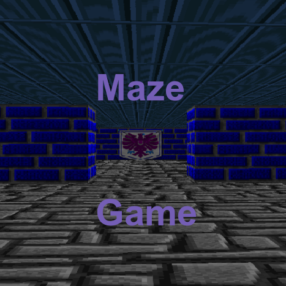
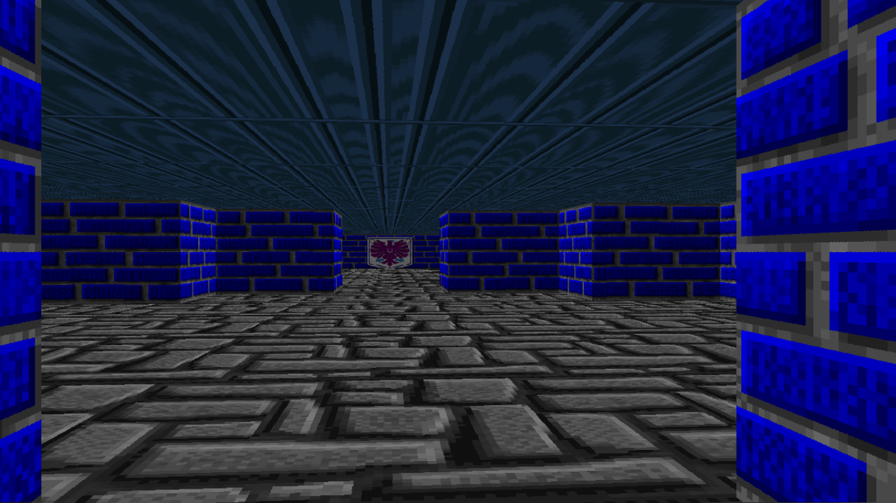
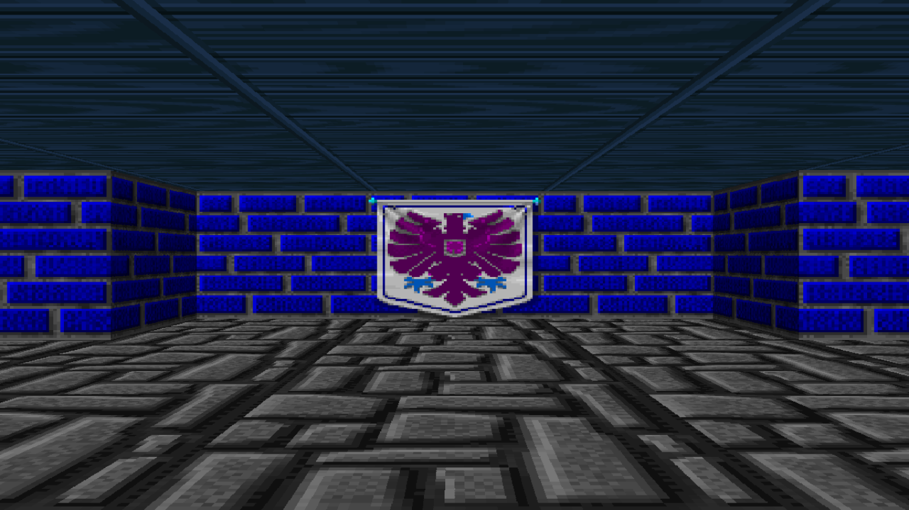
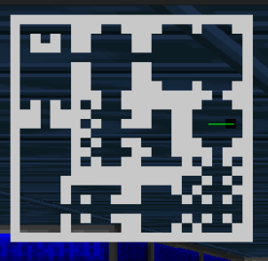

# Maze Game



## Introduction
Welcome to the Maze Game, a 3D maze exploration game built with SDL2. Navigate through the maze, find your way out, and enjoy the thrill of discovery! This project demonstrates the use of ray casting for rendering a 3D maze and provides a fun and interactive gameplay experience.

- **Deployed Site:** [Maze Game](http://example.com)
- **Final Project Blog Article:** [Maze Game Development Journey](http://example.com/blog)
- **Author's LinkedIn:** [Author Name](https://www.linkedin.com/in/authorname/)

## Inspiration
The inspiration for creating the Maze Game came from my fascination with classic games like Wolfenstein 3D and Doom. These games used simple yet powerful techniques to create immersive 3D environments. I wanted to explore how these techniques work and create my own version of a 3D maze game.

## Technical Challenges
This project was a significant technical challenge for me, especially since it involved learning and implementing ray casting from scratch. Some of the key challenges I faced included:

- **Understanding Ray Casting:** Learning how to use ray casting to render 3D environments from 2D maps was a steep learning curve. I spent a lot of time studying tutorials, reading articles, and experimenting with different approaches.
- **SDL2 Integration:** Integrating SDL2 for rendering and handling input was another major challenge. I encountered several issues with setting up the rendering context and handling keyboard events, but persistence and thorough debugging helped me overcome these obstacles.
- **Optimizing Performance:** Ensuring the game runs smoothly required careful optimization. I had to balance rendering quality with performance, making sure the game could run on different hardware configurations.

## Timeline and Development
The development of the Maze Game was a journey filled with ups and downs. Here's a brief timeline of the project's development:

1. **Week 1:** Initial planning and research. Studied ray casting and set up the project structure.
2. **Week 2:** Implemented basic ray casting and map rendering. Faced difficulties with SDL2 and C programming.
3. **Week 3:** Improved rendering quality and added player movement. Started optimizing performance.
4. **Week 4:** Added textures and improved user interface. Began final testing and debugging.
5. **Week 5:** Polished the game, fixed remaining bugs, and prepared for deployment.

## Future Vision
I envision several enhancements for the next iteration of the Maze Game:

- **Enhanced Graphics:** Adding more detailed textures and lighting effects to improve visual quality.
- **Additional Levels:** Creating more complex and varied maze levels to increase replayability.
- **Sound Effects and Music:** Adding immersive sound effects and background music to enhance the gaming experience.
- **Multiplayer Mode:** Implementing a multiplayer mode for players to explore mazes together.

## Algorithm Details
The core algorithm behind the Maze Game is ray casting. Here's a detailed explanation of how it works:

1. **Ray Casting:** The game casts rays from the player's viewpoint into the 2D map. Each ray represents a vertical slice of the screen.
2. **Distance Calculation:** For each ray, the algorithm calculates the distance to the nearest wall. This distance is used to determine the height of the wall slice on the screen.
3. **Wall Rendering:** Based on the calculated distances, the game renders vertical slices of walls with appropriate heights, creating a 3D illusion.
4. **Texture Mapping:** The algorithm maps textures to the wall slices, adding detail to the 3D environment.



## Screenshots and Visuals
Here are some screenshots from our project:





## Installation
To run the Maze Game on your local machine, follow these steps:

1. **Clone the repository:**
   ```sh
   git clone https://github.com/username/maze-game.git
   cd maze-game
   ```

2. **Install SDL2 and SDL2_image:**
   - On Debian-based systems:
     ```sh
     sudo apt-get install libsdl2-dev libsdl2-image-dev
     ```
   - On macOS using Homebrew:
     ```sh
     brew install sdl2 sdl2_image
     ```

3. **Build the game:**
   ```sh
   make
   ```

## Usage
To start the Maze Game, run the following command in your terminal:

```sh
./maze <game_map.map>
```

Use WASD to move through the maze, Ctrl + M to turn on the map and ESCAPE to exit the game.

## Contributing
We welcome contributions from the community. To contribute to this project, please follow these steps:

1. **Fork the repository.**
2. **Create a new branch:**
   ```sh
   git checkout -b feature-branch
   ```
3. **Make your changes.**
4. **Commit your changes:**
   ```sh
   git commit -m 'Add some feature'
   ```
5. **Push to the branch:**
   ```sh
   git push origin feature-branch
   ```
6. **Create a new Pull Request.**

## Related Projects
Here are some related projects that you might find interesting:

- [Raycasting Engine](https://github.com/someuser/raycasting-engine)
- [SDL2 Game Development](https://github.com/anotheruser/sdl2-game-development)

## Licensing
This project is licensed under the MIT License. See the [LICENSE](LICENSE) file for more information.

Feel free to customize the links and paths to images as per your project setup. Let me know if you need any further adjustments!

